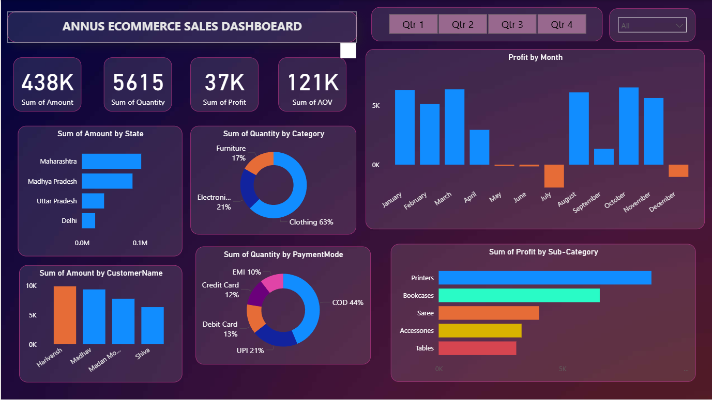

🛒 Ecommerce Dashboard (Power BI)

An interactive Ecommerce Dashboard built in Power BI to analyze sales, customers, products, and orders.
It provides a centralized view of business performance with dynamic reports and visualizations.

🚀 Features

Sales & Revenue Analysis – Track total sales, revenue trends, and average order value.

Order Insights – Pending, shipped, delivered, and cancelled orders.

Customer Analytics – New vs returning customers and purchase behavior.

Product Performance – Best-selling products, low-stock alerts, and category breakdown.

Visual Reports – Interactive charts and filters for real-time analysis.

📊 Insights Covered

📈 Sales trends (daily, monthly, yearly)

🛍️ Top-selling products & categories

👤 Customer demographics and segmentation

📦 Order status and fulfillment rates

💳 Payment method analysis

## 📸 Dashboard Preview  

